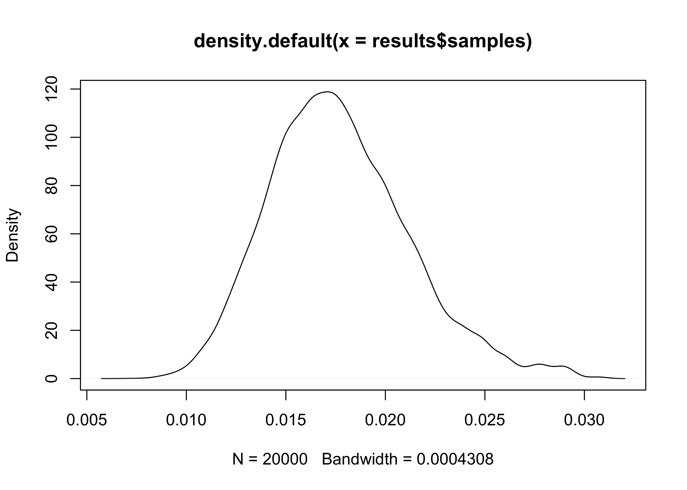

<!-- README.md is generated from README.Rmd. Please edit that file -->

# PooledPrevalence

<!-- badges: start -->

<!-- badges: end -->

A set of tools to help design a laboratory based prevalence study
harnessing the pooling of laboratory samples to increase resource
efficiency. The tools provide guidance in choosing the number of samples
to pool and the total number of tests to perform, focusing on achieving
the maximum estimation performance (low uncertainty and estimation
error) while keeping the total amount of tests low. In the package there
are functions to simulate study outcomes, optimize the study design, and
finally, analyze the results of a pooled study to retrieve the 
prevalence estimates. The package is based on a Bayesian framework, with
the possibility to perform a full hierarchical analysis including
uncertainty due to the sensitivity in acquiring the testing material.
The package was developed at the occasion of the COVID-19 pandemic, but
can be utilized in every laboratory based prevalence study.

This package is produced as a companion to the following guidance from
the European Center for Disease Prevention and Control:
<https://www.ecdc.europa.eu/sites/default/files/documents/Methodology-estimating-point-prevalence%20-SARS-CoV-2-infection-pooled-RT-PCR-testing.pdf>.

\!\!DISCLAIMER: the Hierarchical Bayes method of estimation is still
under development

## Installation

You can install the released version of PooledPrevalence with:

``` r
# install.packages("devtools")
devtools::install_github("EU-ECDC/PooledPrevalence")
```

## Basic usage

The main goal of the package is to estimate prevalence in a
population/risk group, given the results of a pooled laboratory test.
Let’s assume a test with the following design: 2000 individual
biological samples divided in 10 samples per testing pool (pool size),
for a total of 200 pools. In this experiment we observe 30 positive
pools (15%). With get\_estimates it is possible to estimate the underlying
prevalence:

``` r
library(PooledPrevalence)

results <- get_estimates(10, 200, 30)

print(results$estimates)
#>   p_test  k        Est         Lo         Up
#> 1   0.15 30 0.01610737 0.01103635 0.02251263
```

The object `results` contains both the estimates and, if a Bayesian
method is used, the posterior samples of the distribution. The samples
allows the inspection of the full posterior distribution of the
prevalence.

``` r

results <- get_estimates(10, 200, 30)

plot(density(results$samples))
```


With Hierarchical Bayesian (HB) estimation is possible to account for
the risk of false negatives due to incorrect sampling of material.
Notice that the resulting estimates are therefore slightly higher. HB
allows also a more correct evaluation of the uncertainty and should be
the preferred method for the final analyses.

``` r

results <- get_estimates(10, 200, 30, method = 'HB')
#> 
#> 
#> @@@@@@@@@@@@@@@@@@@@@@@@@@@@@@@@@@@@@@@@@@@@@@@@@@@@@@@@@
#> The Metropolis acceptance rate was 0.56020
#> @@@@@@@@@@@@@@@@@@@@@@@@@@@@@@@@@@@@@@@@@@@@@@@@@@@@@@@@@

plot(density(results$samples))
```



## Hypothesis testing

Having access to the posterior samples allows Bayesian hypothesis
testing for decision making. For example a certain region may want to
remove a certain control measure only if the average prevalence is below
2% with a \> 90% probability:

``` r

results <- get_estimates(10, 200, 30, iters = 200000)

mean(results$samples < .02)
#> [1] 0.89222
```

In this case the probability of a mean prevalence below 2% is 89.2%,
therefore there’s not enough evidence in favor of removing the control
measure. We may want to increase the sample size of the study or wait
more. The Bayesian framework allows to simply add new samples the the
already collected ones and simply update the analysis.

``` r

old.results <- get_estimates(10, 200, 30, iters = 200000)

new.tested.pools <- 60

new.positve.pools <- 9

new.results <- get_estimates(10, 200 + new.tested.pools, 30 + new.positve.pools, iters = 200000)

mean(new.results$samples < .02)
#> [1] 0.92104
```

The new probability is 92.1%, so we have enough evidence to remove the
control measure.

Finally we want to ascertain the probability that region A, with 30
positive pools out of 200, has a lower prevalence or region B (38
positive pools out of 180).

``` r

region.A <- get_estimates(10, 200, 30, iters = 200000)

region.B <- get_estimates(10, 180, 38, iters = 200000)

mean(region.A$samples < region.B$samples)
#> [1] 0.939335
```

## Study design optimization

The package provides a tool to help program the most efficient design
for a prevalence study based on pooled testing. The methodology tries to
maximize statistical accuracy while increasing the ratio between pool
size and number of tests.

The user needs to specify the operational limits that are driven by the
available resources (number of sampled individuals `n.max` and maximum
number of laboratory test to perform `w.max`), the expected (maximal)
prevalence, and by the possible reduction in sensitivity due to an
excessive number of samples in the same pool (`s.max`). This number
depends from a number of factors (the pathogen, the sensitivity of the
test, the laboratory infrastructure and technique), therefore it needs
to be decided after appropriate local validation tests. A good starting
point for validation is between 10 and 20 samples per pool.

In the following example we investigate the possible designs for a study
with a maximal pool size of 15 and maximal number of tests and
individuals to sample equal to 2000. We also set a maximal expected
prevalence 0f 5%. Given the nature of pooled testing, the statistical
accuracy decreases with the prevalence, so it is better to select a
value which is higher than the prevalence we actually expect to find, in
order not to end up with an underpowered study.

``` r

grid <- design_optimization(s.max = 15, w.max = 2000, p = .05, n.max = 2000)

plot_optimization_grid(grid)
```


We can observe that the best “optimization window” is achieved with a
pool size `s` of 10 or more and with a number of test `w` higher than
108.

Once a window has been identified, simulation tests can be used to
evaluate the statistical performance. The tests need to be carried on
specific couple of values of pool size `s` and number of tests `w`.

In order to decrease the risk of sensitivity problems we suggest to
evaluate the more conservative designs in term of pool size (lower `s`),
but validation studies can allow to choose a higher value. Regarding the
number of test, one should use the higher number that is achievable
during the study, since the higher the number of tests, the higher the
statistical precision; through pooling the maximum number of test needed
is already decreased by a factor equal to `s` (e.g. for `s == 10`, given
2000 individuals planned for sampling, at maximum `2000 / s = 200` tests
will be done).

Let’s compare the results in term of statistical accuracy using `w
= 109` and `w = 200`.

``` r

simulation.low_w <- simulate_pool_test(s = 10, w = 108, p = 0.05)

print(format_simulation(simulation.low_w))
#>                            [,1]                           
#> Estimated prevalence       "4.9%, 95%CI: [3.6%, 6.7%]"    
#> Estimation uncertainty     "2.9%, 95%CI: [2.4%, 3.5%]"    
#> Estimation error           "0.55%, 95%CI: [5e-04, 1.7%]"  
#> Unpooled study prevalence  "5%, 95%CI: [3.7%, 6.4%]"      
#> Unpooled study uncertainty "2.6%, 95%CI: [2.3%, 2.9%]"    
#> Unpooled study error       "0.47%, 95%CI: [2.7e-05, 1.5%]"

simulation.high_w <- simulate_pool_test(s = 10, w = 200, p = 0.05)

print(format_simulation(simulation.high_w))
#>                            [,1]                          
#> Estimated prevalence       "5%, 95%CI: [4%, 6.2%]"       
#> Estimation uncertainty     "2.2%, 95%CI: [1.9%, 2.5%]"   
#> Estimation error           "0.38%, 95%CI: [0.021%, 1.2%]"
#> Unpooled study prevalence  "5%, 95%CI: [4%, 6%]"         
#> Unpooled study uncertainty "1.9%, 95%CI: [1.7%, 2.1%]"   
#> Unpooled study error       "0.3%, 95%CI: [1.5e-05, 1.1%]"
```

It is possible to see that in both simulation the statistical accuracy
of the pooled design is similar to that achieved through an unpooled
study (e.g. `s_unpooled = 1` and `w_unpooled = w * s`). Instead it’s
possible to observe a definite decrease in uncertainty and error passing
from 108 to 200 tests. In any case both, numbers are definitely lower
than than the 2000 tests that would have been performed wihout pooling.
